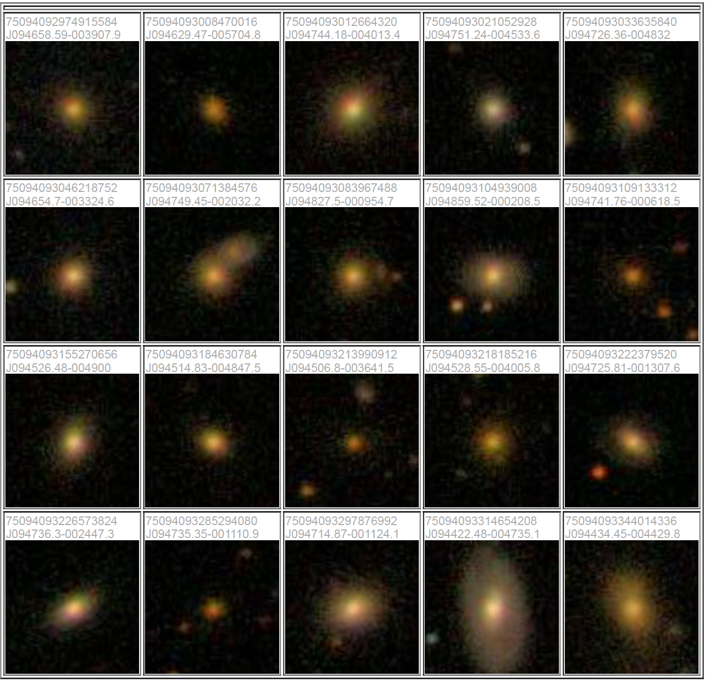
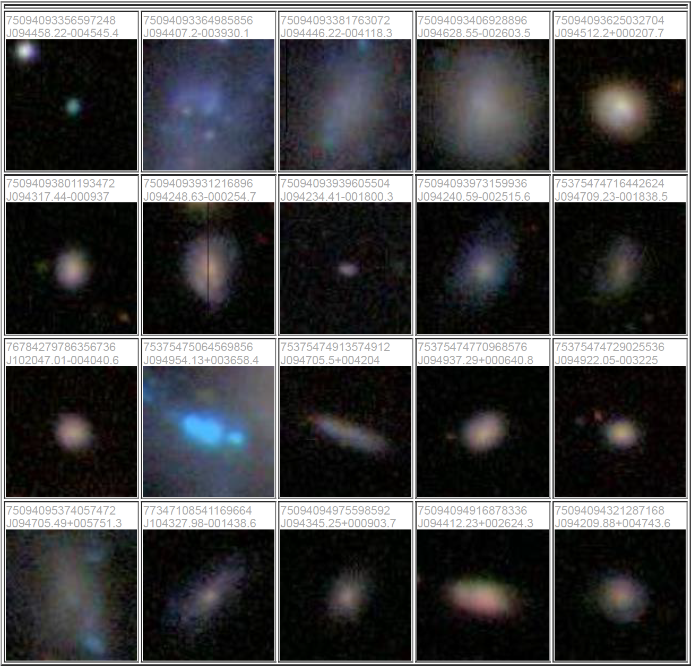
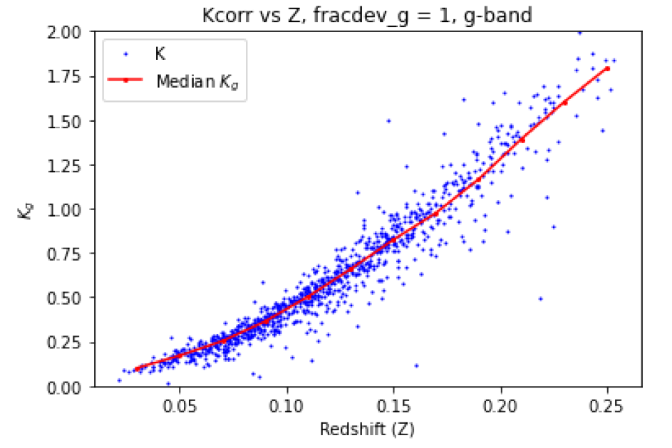
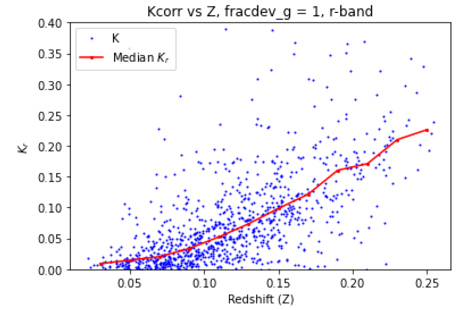
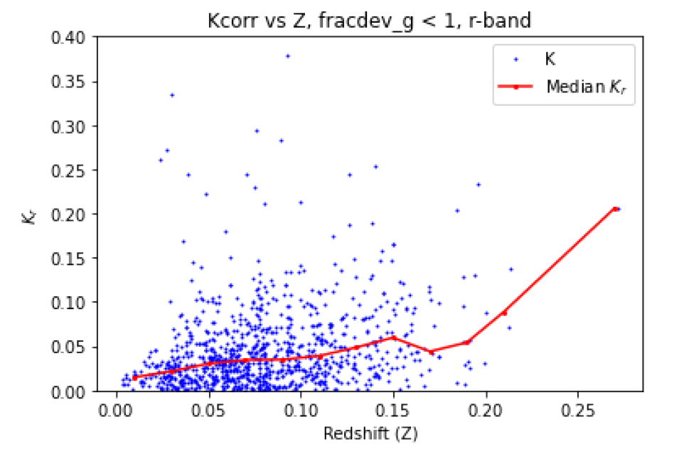
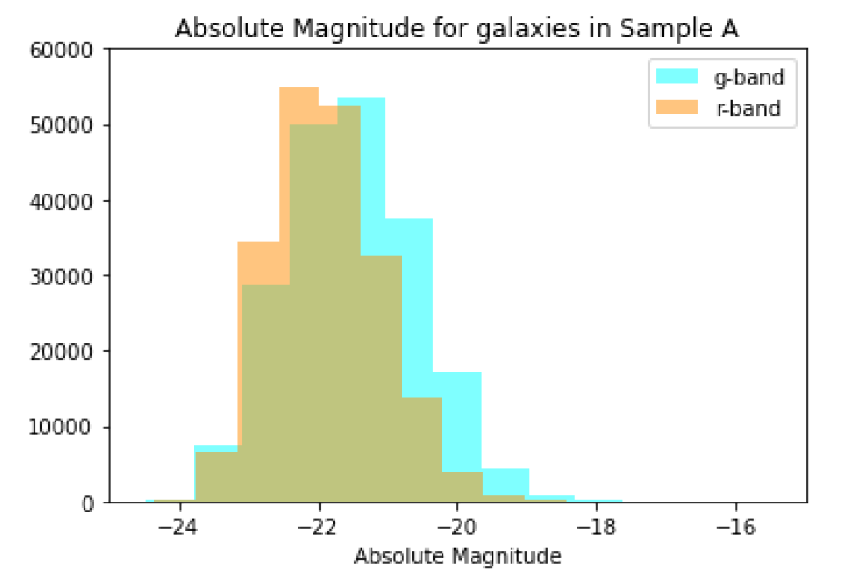
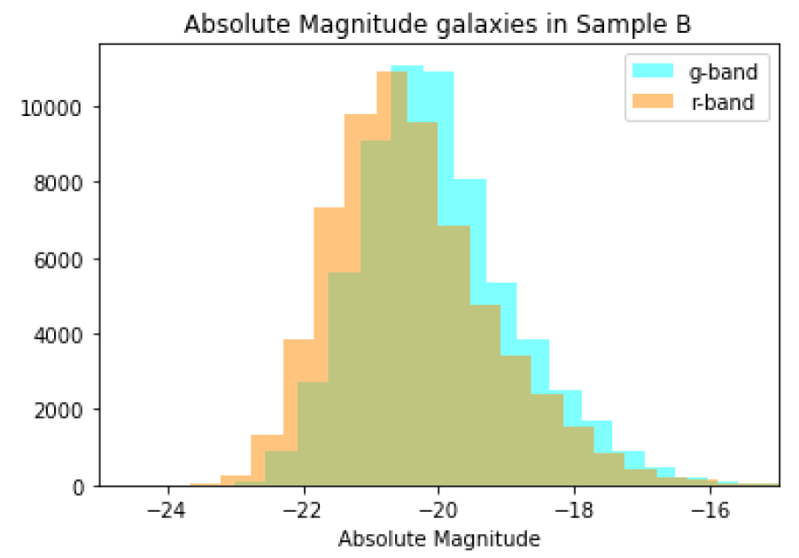
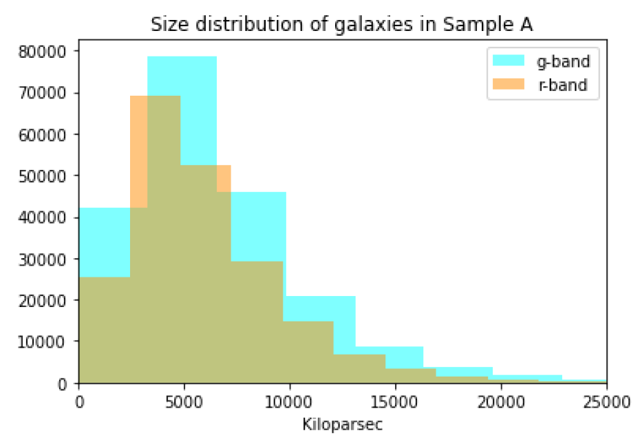
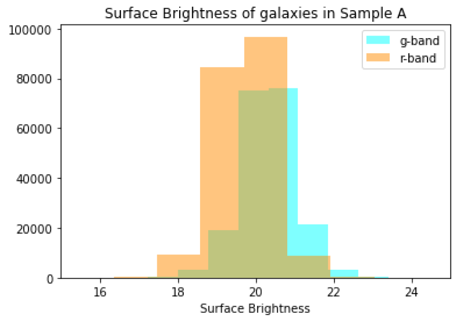
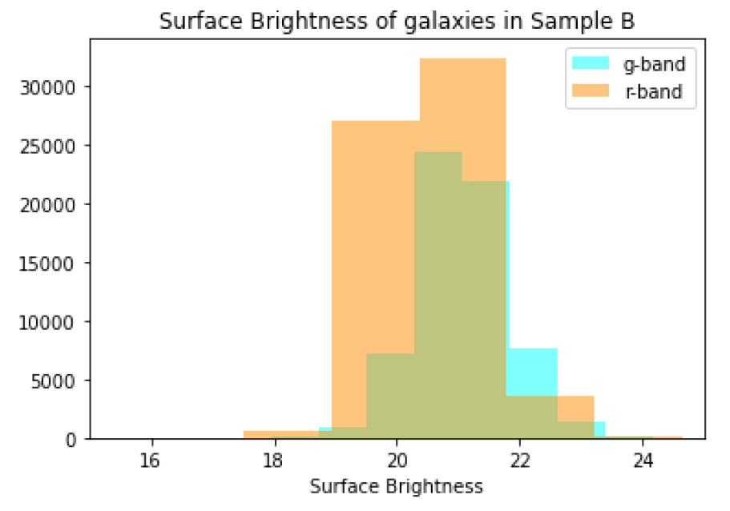

The main goal of this project is to measure the luminosity, physical size, and surface brightness distribution of a sample of “early-type” (E, S0) and
late-type (S) galaxies. For this project, we use the Sloan Digital Sky Survey (SDSS) “g” and “r” bands from Data Release 7.

Before I begin analyzing galaxy data, I have to first retrieve it from the SDSS database. To do so, log into the SDSS database at https://casjobs.sdss.org/CasJobs/ and write the following two SQL queries.

### SQL query to retrieve galaxy data from SDSS database:
```
-- Query for Sample A (Early-type Galaxies)
SELECT TOP 5000
  gal.modelmag_g, gal.devmag_g, gal.expmag_g, gal.devrad_g, gal.exprad_g, gal.expab_g,
  gal.extinction_g, gal.z, gal.modelmag_r, gal.devmag_r, gal.expmag_r, gal.devrad_r, gal.expab_r,
  gal.extinction_r
FROM Galaxy AS gal
JOIN specObj AS sp
ON gal.specObjID=sp.specObjID
WHERE
  gal.petroR90_r/gal.petroR50_r > 2.4
  AND sp.eclass < 0
  AND gal.fracdev_g = 1


-- Query for Sample B (Late-type Galaxies)
SELECT TOP 5000
  gal.modelmag_g, gal.devmag_g, gal.expmag_g, gal.devrad_g, gal.exprad_g, gal.expab_g,
  gal.extinction_g, gal.z, gal.modelmag_r, gal.devmag_r, gal.expmag_r, gal.devrad_r, gal.expab_r,
  gal.extinction_r
FROM Galaxy AS gal
JOIN specObj AS sp
ON gal.specObjID=sp.specObjID
WHERE
  gal.petroR90_r/gal.petroR50_r < 2.2
  AND sp.eclass > 0.05
  AND (gal.fracdev_g BETWEEN 0 and 0.3)
```

After querying the SDSS database with SQL to retrieve galaxy parameters, I visually inspected the following samples of galaxy images using SDSS's SkyServer Explorer:

<!--Sample A:

Sample B:
-->

<b style="font-size: 24px;">Sample A:</b>

<b style="font-size: 24px;">Sample B:</b>


Sample A's galaxies appear redder in color, while Sample B's appear more blue. Sample A's galaxies also seem more dense with very little structure, while Sample B's are less dense and some appear to have more structure. This tells us that Sample A most likely consists of early-type galaxies such as elliptical and lenticular galaxies, while Sample B most likely contains later type galaxies like spiral galaxies. 

Next, I computed K-corrections, which account for the effects of redshift on galaxy brightness, by analyzing flux data from the SDSS database and applying filter responses and reddening corrections to galaxy spectra. This involved interpolating filter data to estimate responses at specific wavelengths, allowing me to visualize and understand the results.

Below is a sample of my code used to calculate the observed magnitudes for both the r-band and g-band, which is are values needed to calculate the K-correction. This calculation is also where I interpolated the filter data to estimate the filter response at the exact wavelength of the spectral data.


### Calculating the observed magnitudes for r-band and g-band:
```
# Dictionaries to store observed magnitude values
Mobs_r = {}
Mobs_g = {}

# Iterate through each galaxy's spectral data
for key, data in filtered_spec.items():
    # Extract wavelengths and fluxes from spectral data
    wavlen_obs = data[:, 0]
    flux = data[:, 1]

    # Calculate differential wavelength for each galaxy
    dlambda_r = np.gradient(wavlen_obs)
    dlambda_g = np.gradient(wavlen_obs)

    # Interpolate filter responses at galaxy's wavelengths
    interp_resp_r = np.interp(wavlen_obs, r_wavlen, r_resp)
    interp_resp_g = np.interp(wavlen_obs, g_wavlen, g_resp)

    # Calculate observed magnitudes using interpolated responses
    r_int = np.trapz(flux * interp_resp_r * (wavlen_obs ** 2) * dlambda_r, wavlen_obs)
    r_mobs = -2.5 * np.log(r_int)
    Mobs_r[key] = r_mobs

    # Repeat for g-band
    g_int = np.trapz(flux * interp_resp_g * (wavlen_obs ** 2) * dlambda_g, wavlen_obs)
    g_mobs = -2.5 * np.log(g_int)
    Mobs_g[key] = g_mobs
```

After doing a similar calculation for the magnitudes of the g-band and r-bands in the restframe, I'm finally ready to calculate the K-correction values.

### Calculating K-correction values for the r-band and g-band:
```
# Create dictionaries to store the differences in magnitudes
K_r = {}
K_g = {}

# Iterate through the galaxies in your dictionaries
for key in Mobs_r:
    if key in Mrest_r and key in Mobs_g and key in Mrest_g:
        # Calculate the difference in magnitudes for each filter
        K_r[key] = abs(Mobs_r[key] - Mrest_r[key])
        K_g[key] = abs(Mobs_g[key] - Mrest_g[key])
```

Next, I compute the median K-correction in small redshift bins ($$\Deltaz = 0.02$$), then I am finally ready to plot the K-correction versus the redshift values! Below is a sample of my code used to do just that.

### Data Preparation:
```
# Setting bin edges
bin_edges = [0.0, 0.02, 0.04, 0.06, 0.08, 0.10, 0.12, 0.14, 0.16, 0.18, 0.20, 0.22, 0.24, 0.26, 0.28]

z_values = []
kr_values = []

for key in fracdev_g:
    cleaned_key = key.strip()
    if cleaned_key in z_dict and cleaned_key in K_r:
        z = z_dict[cleaned_key]
        if fracdev_g[cleaned_key] == 1:
            z_values.append(z)
            kr_values.append(K_r[cleaned_key])
```
### Calculating median K-correction values:
```
bin_centers = []
Kcorr_r_med1 = []

for i in range(len(bin_edges) - 1):
    bin_start = bin_edges[i]
    bin_end = bin_edges[i + 1]

    # Collect the K_r values within the current redshift bin
    kr_values_inbin = [kr for z, kr in zip(z_values, kr_values) if bin_start <= z < bin_end]

    if kr_values_inbin:
        med_r = np.median(kr_values_inbin)
        bin_centers.append((bin_start + bin_end) / 2)
        Kcorr_r_med1.append(med_r)
        K_med_r[(bin_start, bin_end)] = med_r
```
### Plotting the results:
```
# Plot the actual K_r values versus redshift
plt.plot(z_values, kr_values, marker='o', linestyle='', color='blue', markersize=1, label='K')

# Plot the median K_r values
plt.plot(bin_centers, Kcorr_r_med1, marker='o', linestyle='-', color='red', markersize=2, label='Median $K_r$')

# Set labels and legend
plt.xlabel('Redshift (Z)')
plt.ylabel('$K_r$')
plt.ylim(0, 0.4)
plt.title("Kcorr vs Z, fracdev_g = 1, r-band")
plt.legend()
plt.savefig("kcorr_r_fracdev1.png")
plt.show()
```

## K-correction values versus redshift plots:

<style>
.image-grid {
  display: grid;
  grid-template-columns: 1fr 1fr;
  grid-gap: 10px;
}

.image-grid img {
  width: 100%;
  height: auto;
}

.image-grid figcaption {
  text-align: center; /* center the caption */
  font-style: italic; /* italicize the caption */
  font-size: 14px; /* reduce the font size */
  margin-top: 5px; /* add some space between the image and caption */
}
</style>

<div class="image-grid">
  <figure>
    
    <figcaption>De Vaucouleurs Dominated (fracdev = 1) G-Band</figcaption>
  </figure>
  <figure>
    
    <figcaption>De Vaucouleurs Dominated (fracdev = 1) R-Band</figcaption>
  </figure>
  <figure>
    
    <figcaption>Mixed De Vaucouleurs and Exponential Light Distribution (fracdev < 1) G-Band</figcaption>
  </figure>
  <figure>
    
    <figcaption>Mixed De Vaucouleurs and Exponential Light Distribution (fracdev < 1) R-Band</figcaption>
  </figure>
</div>

The above plots show K-corrections as a function of redshift for galaxies with different light profile characteristics (fracdev). The plots show the relationship between K-correction values (y-axis) and redshift (x-axis) for galaxies with fracdev = 1 and fracdev < 1 in the g and r bands.

The plots reveal a clear trend of increasing K-correction values with redshift, which is consistent with theoretical expectations. Notably, galaxies with fracdev = 1 exhibit systematically higher K-correction values than those with fracdev < 1, particularly in the g band. The difference in K-correction values between galaxies with pure de Vaucouleurs profiles (fracdev = 1) and galaxies with composite profiles (fracdev < 1) likely indicates distinct evolutionary pathways. Galaxies with pure de Vaucouleurs profiles could be more evolved, with a higher proportion of older stars, indicating a more quiescent stellar population, whereas those with composite profiles might be less evolved, with ongoing star formation, suggesting a more active and dynamic stellar population.

This trend is consistent with the visual differences observed in the galaxy images, where galaxies in Sample A (which have fracdev = 1) appeared redder, denser, and less structured, characteristic of early-type galaxies, whereas those in Sample B (which have fracdev < 1) appeared bluer, less dense, and more structured, typical of later-type galaxies.

Finally, I derived K-correction functions (K(z)) using linear interpolation and applied them to calculate absolute magnitudes, sizes, and surface brightness for Samples A and B in the g-band and r-band, creating comparative distribution plots.

### K-Correction Interpolation Code Snippet
To calculate K-corrections, I used linear interpolation to derive functions K(z) for Samples A and B.
```
k_r_1 = interpolate.interp1d(bin_centers, Kcorr_r_med1, bounds_error=False)
```
### Galaxy Property Calculations Code Snippet
Using the K-correction functions, I calculated absolute magnitudes, sizes, and surface brightness for Samples A and B.
```
def luminosity_dist(z):
    H_0 = 70 # km/s/Mpc
    c = 3*10**5 # km/s
    d_p = (c/H_0)*integrate.quad(e_int,0,z)[0] # Mpc
    d_L = (1+z)*d_p
    return d_L*10**6. # parsec

def e_int(z):
    omega_m = 0.3
    omega_lambda = 0.7
    e = ((1+z)**2*(1+omega_m*z) - omega_lambda*z*(2+z))**(-1./2.)
    return e

# Calculate absolute magnitudes
sampleA_z["M_g"] =  sampleA_z["devmag_g"] - 5*np.log10(sampleA_z["d_L"]) + 5 -  sampleA_z["k_g"] - sampleA_z["extinction_g"]

# Calculate sizes
sampleA_z['size_g'] = sampleA_z['r_eff_g']*sampleA_z['d_L']

# Calculate surface brightness
sampleA_z["sb_g"] = sampleA_z["devmag_g"] - sampleA_z["k_g"] + 5*np.log10(sampleA_z["r_eff_g_arc"]) + 2.5*np.log10(2*np.pi) - 10*np.log10(1+sampleA_z["z"])
```

## Resulting Distribution Plots:

<style>
.image-grid {
  display: grid;
  grid-template-columns: 1fr 1fr;
  grid-gap: 10px;
  grid-auto-rows: minmax(100px, auto);
}

.image-grid img {
  width: 100%;
  height: auto;
}
</style>

<div class="image-grid">
  <div>
    
  </div>
  <div>
    
  </div>
  <div>
    
  </div>
  <div>
    
  </div>
  <div>
    
  </div>
  <div>
    
  </div>
</div>

As you can see, the galaxies in Sample A are more luminous than those in Sample B given the Absolute Magnitude distributions. This makes sense when you also look at the physical size distributions of the two samples, since Sample A has more larger galaxies than Sample B. The galaxies in Sample B lean toward a slightly higher surface brightness than those in Sample A, which might seem surprising given the galaxies in Sample A are more luminous overall, however, surface brightness is a measure of luminosity emitted per unit surface area. Thus, since the galaxies in Sample B tend to be physically smaller than those in Sample A, it makes sense that the surface brightness, or luminosity emitted per unit surface area is slightly higher than the larger galaxies in sample A. These differences in luminosity, size, and surface brightness between Sample A and Sample B are consistent with the expected differences between early-type (elliptical and lenticular) and late-type (spiral) galaxies, where early-type galaxies tend to be larger, more luminous, and less dense than late-type galaxies.
