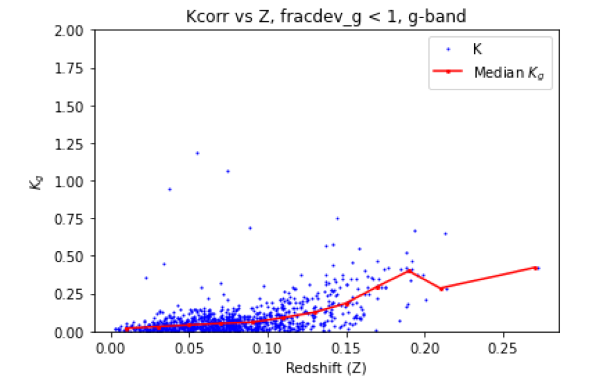
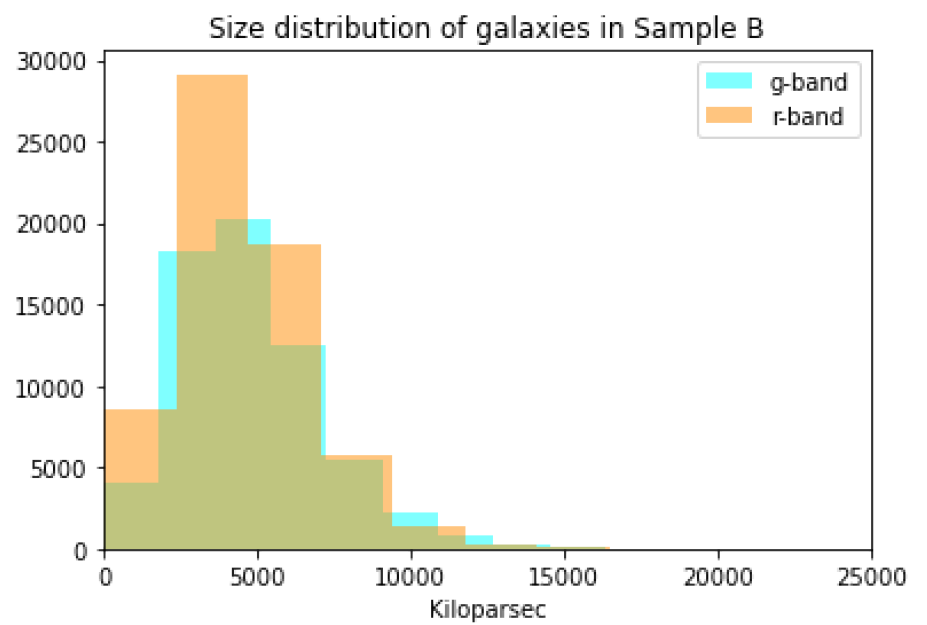

The main goal of this project is to measure the luminosity, physical size, and surface brightness distribution of a sample of “early-type” (E, S0) and
late-type (S) galaxies. For this project, we use the Sloan Digital Sky Survey (SDSS) “g” and “r” bands from Data Release 7.

After querying the SDSS database with SQL to retrieve galaxy parameters, I visually inspected the following samples of galaxy images using SDSS's SkyServer Explorer:

<!--Sample A:

Sample B:
-->

<b style="font-size: 24px;">Sample A:</b>

<b style="font-size: 24px;">Sample B:</b>

Sample A's galaxies appear redder in color, while Sample B's appear more blue. Sample A's galaxies also seem more dense with very little structure, while Sample B's are less dense and some appear to have more structure. This tells us that Sample A most likely consists of early-type galaxies such as elliptical and lenticular galaxies, while Sample B most likely contains later type galaxies like spiral galaxies. 

Next, I computed K-corrections, which account for the effects of redshift on galaxy brightness, by analyzing flux data from the SDSS database and applying filter responses and reddening corrections to galaxy spectra. This involved interpolating filter data to estimate responses at specific wavelengths, allowing me to visualize and understand the results.

  <figure>
    
    <figcaption>De Vaucouleurs Dominated (fracdev = 1) G-Band</figcaption>
  </figure>
  <figure>
    
    <figcaption>De Vaucouleurs Dominated (fracdev = 1) R-Band</figcaption>
  </figure>
  <figure>
    
    <figcaption>Mixed De Vaucouleurs and Exponential Light Distribution (fracdev < 1) G-Band</figcaption>
  </figure>
  <figure>
    
    <figcaption>Mixed De Vaucouleurs and Exponential Light Distribution (fracdev < 1) R-Band</figcaption>
  </figure>

The above plots show K-corrections as a function of redshift for galaxies with different light profile characteristics (fracdev). The plots show the relationship between K-correction values (y-axis) and redshift (x-axis) for galaxies with fracdev = 1 and fracdev < 1 in the g and r bands.

The plots reveal a clear trend of increasing K-correction values with redshift, which is consistent with theoretical expectations. Notably, galaxies with fracdev = 1 exhibit systematically higher K-correction values than those with fracdev < 1, particularly in the g band. The difference in K-correction values between galaxies with pure de Vaucouleurs profiles (fracdev = 1) and galaxies with composite profiles (fracdev < 1) likely indicates distinct evolutionary pathways. Galaxies with pure de Vaucouleurs profiles could be more evolved, with a higher proportion of older stars, indicating a more quiescent stellar population, whereas those with composite profiles might be less evolved, with ongoing star formation, suggesting a more active and dynamic stellar population.

This trend is consistent with the visual differences observed in the galaxy images, where galaxies in Sample A (which have fracdev = 1) appeared redder, denser, and less structured, characteristic of early-type galaxies, whereas those in Sample B (which have fracdev < 1) appeared bluer, less dense, and more structured, typical of later-type galaxies.

Finally, I derived K-correction functions (K(z)) and used them to calculate absolute magnitudes, sizes, and surface brightness for Samples A and B in the g- and r-bands, creating comparative distribution plots.

  

    
  

  

    
  

  

    
  

  

    
  

  

    
  

  

    
  

