## Introduction:
The goal of this project was to investigate the properties and evolution of galaxies through a series of analyses, with a focus on understanding selection effects, galaxy structure, and the relationships between galaxy properties.

In <a href="[URL](https://juliarobe.github.io/projects/GalaxyMorphology&Evolution.html)"> the Galaxy Morphology and Evolution project</a>, we downloaded two samples of 5000 galaxies. The samples data contained the apparent magnitudes, scale radii, the axis ratio (a/b), redshift and more. Using this data, I computed the K-correction, the luminosity distance $d_L$, the absolute magnitude $M_{abs}$, the surface brightness $\mu $, and the physical size and for each galaxy.

For this project, I build upon my calculations from <a href="[URL](https://juliarobe.github.io/projects/GalaxyMorphology&Evolution.html)"> the Galaxy Morphology and Evolution project</a> by accounting for the galaxies surveys selection effect, which just refers to the biases that arise from the way galaxies are selected for observation in a sample.

In <a href="[URL](https://juliarobe.github.io/projects/GalaxyMorphology&Evolution.html)"> the Galaxy Morphology and Evolution project</a>, I calculated and plotted the absolute magnitude, physical size, and surface brightness distributions. In this project, I use the V-max technique to correct for selection effects, and compare the original observed distributions of absolute magnitudes, physical sizes and surface brightnesses to the distributions that are corrected for selection effects. 

For the next part of this project, I examine the observed 1D radial surface brightness of galaxies and find the best fit surface brightness profile for each galaxys' data. Galaxies generally exhibit an Exponential profile, deVaucouler profile, Sersic profile, or a combination of deVaucouler and Exponential profiles. 

Next, using the data I downloaded in <a href="[URL](https://juliarobe.github.io/projects/GalaxyMorphology&Evolution.html)"> the Galaxy Morphology and Evolution project</a>, I compute the concentration index, which describes the distribution of light or mass within the galaxy and how concentrate or dispersed it is. I then bin galaxies in small absolute magnitude bins and plot the concentration index versus redshift. 

Finally, I computed the median radius in both the r and g band in small bins of the evolution corrected absolute magnitudes in just the r-band.

## Part 1: Correcting for Selection Effects

### What is the V-max technique?
The V-max is the maximum volume within which a galaxy could be detected by a survey, given its sensitivity and selection criteria. To calculate the V-max, you need the apparent magnitude limit, which is the faintest magnitude that the survey can detect, the absolute magnitudes of the galaxies, the redshifts, the K-corrections, and the evolutionary correction, which is the correction for the change in the galaxy's brightness over time. Using these variables, one can calculate the maximum distance (or redshift) at which the galaxy could be detected by the survey. This distance is then used to calculate the maximum volume (V-max) within which the galaxy could be detected. Once the V-max is computed, each galaxy in the sample can be weighted by its V-max value, which ensures that the galaxies that could be detected over a larger volume are given more weight in the analysis. By weighting each galaxy by its Vmax value, you can correct for the biases in the sample and obtain a more accurate representation of the galaxy population.

### Calculating V-max:
To calculate the V-max, I first had to calculate the corrected apparent magnitude (m_corr) and the absolute magnitude limit (Mlim). I then matched the galaxies based on their observed magnitude (M_r) being less than the absolute magnitude limit. I also calculate the maximum luminosity distance (dL_lim_kpc) at which a galaxy could be detected by the survey. I then calculate the volume limit (Vlim) using the maximum luminosity distance and the absolute magnitude limit. 

```
data['m_corr'] = 17.5 - data['k_r'] + data['z'] * 1.3
data['Mlim'] = data['m_corr'] - 5*np.log10(data['dL_kpc']) - 25
matched_gals = data[data['M_r'] <= data['Mlim']]

x = (data['m_corr'] - data['Mlim']) / 5
dL_lim_pc = (10 ** x) * 10**(1/5) #pc
dL_lim_kpc = dL_lim_pc / 1000
Vlim = (4/3)*np.pi*(dL_lim_kpc**3)
```

### Weighting galaxies:
I calculated the weight (weight) for each galaxy as the inverse of the volume limit Vlim. I then normalized the weights by dividing by the sum of the weights and the number of galaxies.

```
weight = 1/Vlim
weight_norm = weight / np.sum(weight) / len(weight)
```

### Fitting Q:
I defined a function fit_Q that takes a parameter Q and calculates the volume limit (Vlim_fit) using an interpolation function (Vz_M_interpfit) to relate the absolute magnitude limit (Mlim_fit) to the volume limit (Vlim_arr). The parameter Q was used to adjust the calculation of Mlim_fit. I then minimized the function fit_Q using the minimize function to find the optimal value of Q. By minimizing the fit_Q function, I was essentially finding the optimal value of Q that resulted in the best agreement between the calculated volume limit (Vlim_fit) and the actual volume limit (Vlim_arr). The optimal value of Q was then used to improve the accuracy of the V-max correction, which is essential for obtaining an unbiased estimate of the galaxy luminosity function. 

In other words, the fitting of Q is a refinement step to ensure that the V-max correction was as accurate as possible, which is critical for making reliable conclusions about the galaxy population.

```
Vlim_arr = np.linspace(np.min(Vlim), np.max(Vlim), 4913)

def fit_Q(Q):
    Mlim_fit = M_lim(z_arr, Q, data['k_r'].values)
    Vz_M_interpfit = interpolate.interp1d(Mlim_fit, Vlim_arr, bounds_error=False, fill_value='extrapolate')
    Vlim_fit = Vz_M_interpfit(data['M_r'].values)

    mask_fit = np.isnan(Vlim_fit)
    return np.abs(np.sum(Vlim_arr[~mask_fit] / Vlim_fit[~mask_fit]) - (len(data['M_r'].values[~mask_fit]) / 2))

result = minimize(fit_Q, 1.3)
optimal_Q = result.x[0]
print("Optimal Q:", optimal_Q)
```

### Distribution plots:
The three plots below show the observed galaxy data distributions (blue) versus the V-max corrected distributions (orange).

<h2 style="text-align: center;">Absolute Magnitude Distribution: Observed vs V-max Corrected</h2>
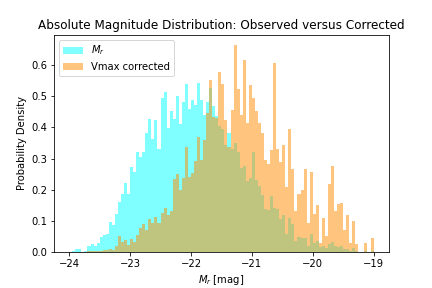

For the absolute magnitude distribution, the V-max corrected distribution is more spread and shifted towards fainter, less luminous galaxies. Thus, we see that the original, uncorrected distribution was biased towards brighter galaxies. 

<h2 style="text-align: center;">Physical Size Distribution: Observed vs V-max Corrected:</h2>
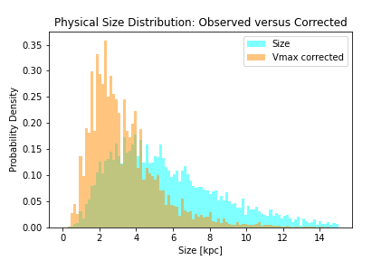

For the physical size distribution, the V-max corrected distribution is shifted to the left towards smaller sizes, suggesting that the uncorrected distribution was biased towards larger galaxies. This makes sense since larger galaxies are easier to detect, especially at larger distances. 

<h2 style="text-align: center;">Surface Brightness Distribution: Observed vs V-max Corrected:</h2>
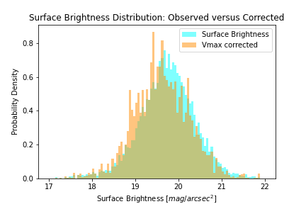

For the surface brightness distribution, the corrected distribution has a similar median value as before, suggesting that the correction did not significantly affect the typical surface brightness distribution of galaxies. The slightly larger spread in the corrected distribution seems due to the inclusion of more faint or low-surface-brightness galaxies.


## Part 2: Best Fit 1D Radial Surface Brightness Profiles
I will show you three galaxies for which I:
- Plotted their observed radial surface brightness profiles.
- Plotted the fitted deVaucouleurs, exponential, Sersic, and deVaucouleurs + exponential profiles.
- Calculated the best-fit radial surface brightness profiles by using the least squares method (this just included calculating the residuals ($\mu_{observed} - \mu_{fit}$), summing the square of those residuals, and minimizing the sum of squared residuals)

### Radial Surface Profile Models:
  ```
  def sersic_fit(R, R_e, mu_e, n):
    b = 1.999*n - 0.327
    mu = mu_e + (2.5*b/np.log(10))*((R/R_e)**(1/n) - 1)
    return mu

def dev_fit(R, R_e, mu_e):
    mu = mu_e + 8.327*((R/R_e)**0.25-1)
    return mu

def exp_fit(R, R_e, mu_e):
    mu = mu_e + (2.5*1.67/np.log(10))*((R/R_e) - 1)
    return mu

def dev_exp_fit(R, R_e, mu_dev ,mu_exp):
    return dev_fit(R, R_e, mu_dev) + exp_fit(R, R_e, mu_exp)
  ```

### Fitting the data & least squares method:
```
gal3x = gal3['#Rad[arcsec]'].values
gal3y = gal3['mu[mag/arcsec^2]'].values

#fitting:
params3_ser, _ = curve_fit(sersic_fit, gal3x, gal3y)
params3_dev, _ = curve_fit(dev_fit, gal3x, gal3y)
params3_exp, _ = curve_fit(exp_fit, gal3x, gal3y)
params3_devexp, _ = curve_fit(dev_exp_fit, gal3x, gal3y)

#Least Squares:
gal3y_serfit = sersic_fit(gal3x, *params3_ser)
res3ser = gal3y - gal3y_serfit

gal3y_devfit = dev_fit(gal3x, *params3_dev)
res3dev = gal3y - gal3y_devfit

gal3y_devexpfit = dev_exp_fit(gal3x, *params3_devexp)
res3devexp = gal3y - gal3y_devexpfit

# Calculate the sum of squared residuals
sum_res_ser = np.sum(res3ser**2)
sum_res_dev = np.sum(res3dev**2)
sum_res_devexp = np.sum(res3devexp**2)

# Find the fit with the minimal sum of squared residuals
best_fit = min(sum_res_ser, sum_res_dev, sum_res_devexp)

if best_fit == sum_res_ser:
    print("Sersic Fit is the best.")
elif best_fit == sum_res_dev:
    print("DeVaucouleur Fit is the best.")
else:
    print("DeVaucouleur + Exponential Fit is the best.")
```
### Profile Fits:
<h2 style="text-align: center;">Galaxy 3 Profiles:</h2>
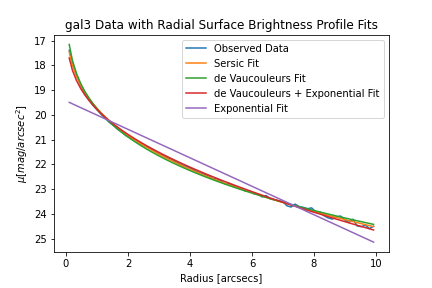


Although the best fit surface brightness profile is difficult to determine by eye, the least squares method tells me that the Sersic fit is the best fit.

<h2 style="text-align: center;">Galaxy 10 Profiles:</h2>
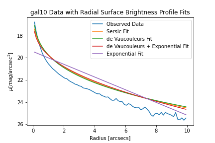


For this galaxy, the deVaucouleurs fit looks the closest to the observed data, although none of the profiles fit the data super well. Indeed, the least squares method tells me that the deVaucaoleurs fit is the best.

<h2 style="text-align: center;">Galaxy 14 Profiles:</h2>
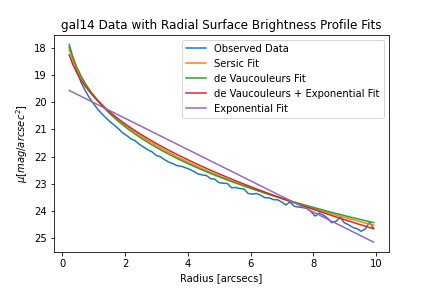


For this galaxy, it seems like deVaucouleurs fit is the best fit, and the least squares method confirms this. 

## Part 3: Concentration Index versus Redshift

### Concentration index:
Using the data I obtained during <a href="[URL](https://juliarobe.github.io/projects/GalaxyMorphology&Evolution.html)"> the Galaxy Morphology and Evolution project</a>, I computed the concentration index by dividing the radius at which the surface brightness of the galaxy falls to 90% of the sky brightness (the Petrosian radius, R90) by the radius at which the surface brightness of the galaxy falls to 50% of the sky brightness (the Petrosian radius, R50). The concentration index provides a measure of how concentrated the galaxy's light is towards its center, since R90  typically encloses most of the galaxy's light and R50 is often used as a measure of the galaxy's half-light radius, which is the radius that encloses half of the galaxy's total light. Therefore, a higher concentration index indicates that the galaxy's light is more concentrated towards its center, while a lower concentration index indicates a more diffuse light distribution.

### Binning the data:
After calculating the concentration index for each galaxy, I binned the data by absolute magnitude and by redshift values:

```
#binning by magnitude and z:
sampleA['mag_bin'] = np.floor(sampleA['M_r'] / 0.5) * 0.5
sampleA['z_bin'] = np.floor(sampleA['z'] / 0.02) * 0.02

mag_bins_a = np.sort(np.unique(sampleA['mag_bin'][~np.isnan(sampleA['M_r'])]))[::-1]
z_bins_a = np.sort(np.unique(sampleA['z_bin'][~np.isnan(sampleA['z'])]))
```

### Plotting the data:

Finally, I am able to make the following plots:

<h2 style="text-align: center;">Sample A Concentration Index versus Redshift:</h2>


<h2 style="text-align: center;">Sample B Concentration Index versus Redshift:</h2>
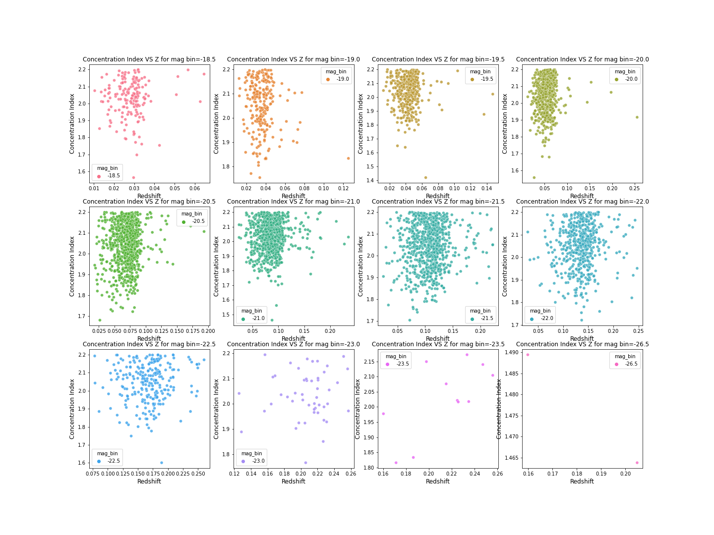

<h2 style="text-align: center;">Sample A Scatterplot of Concentration Index versus Redshift:</h2>
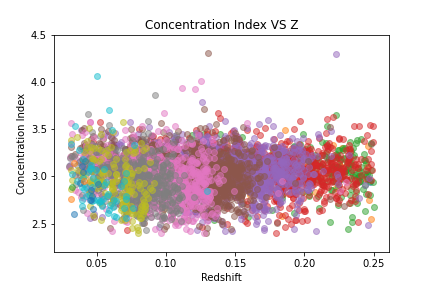

<h2 style="text-align: center;">Sample B Scatterplot of Concentration Index versus Redshift:</h2>
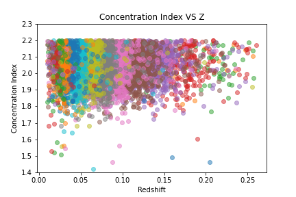

<h2 style="text-align: center;">Median Concentration Index versus Redshift:</h2>
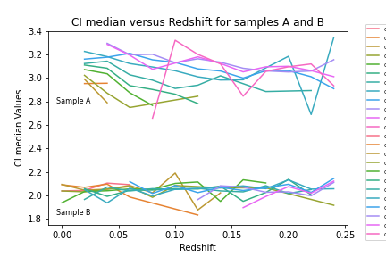

Sample A's galaxies clearly have higher concentration indices than Sample B's, indicating that Sample A's galaxies have more centrally concentrated light profiles, whereas Sample B's galaxies have more diffuse light profiles. 

## Part 4: Median Radius versus Evolution Corrected Absolute Magnitude

Here, I compute the median radius in both the r-band ($$R_r $$) and the g-band ($$R_g $$) in small bins of the evolution corrected r-band absolute magnitudes. Then, I plot the difference of the median values $$R_r - R_g $$ versus the evolution corrected r-band absolute magnitude.

### Plots:

<h2 style="text-align: center;">Median Radius vs Evolution Corrected Abs Magnitudes:</h2>
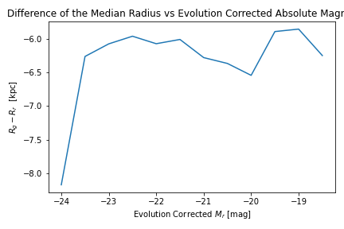

<h2 style="text-align: center;">Difference of Median Radius vs Evolution Corrected Abs Magnitude:</h2>
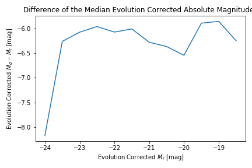

The estimate for $$R_g $$ is slightly higher than that for $$R_r $$ at several points, indicating a systematic difference between the two bands. This discrepancy arises from the filter effect, where the observed flux in the g-band is affected by the redshift of the galaxies, causing the light to be shifted towards shorter wavelengths. To correct for this effect, a k-correction is necessary to convert the observed magnitudes to their respective rest-frame values. The k-correction involves calculating the flux in the rest-frame and observed-frame, taking into account the telescope's filter response. By applying this correction, we can obtain a more accurate estimate of the galaxy sizes, unbiased by the effects of redshift. This correction is particularly important when comparing galaxy properties across different redshifts or bands.
