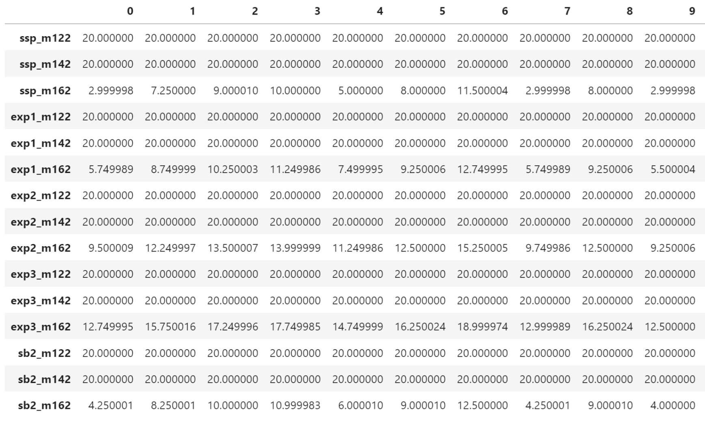
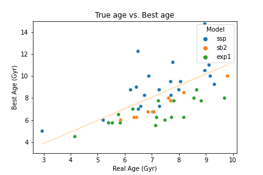
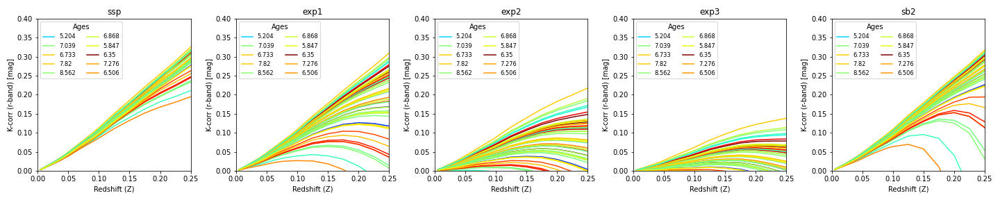
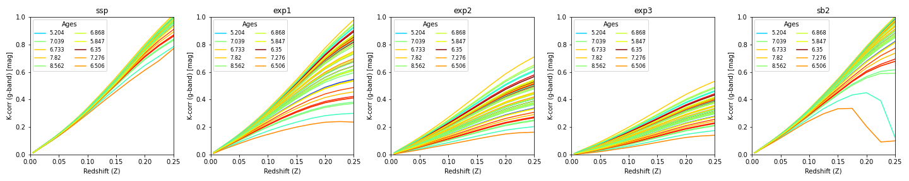
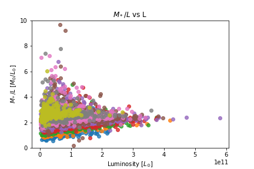
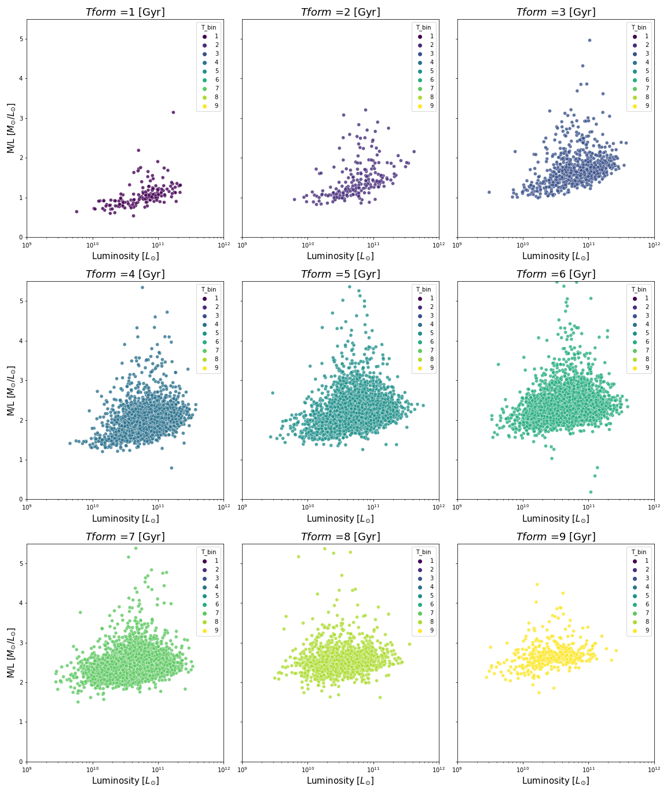
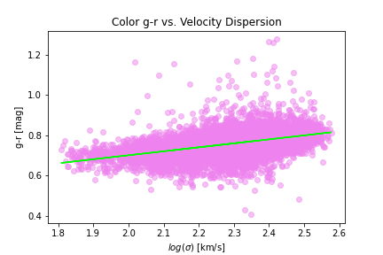
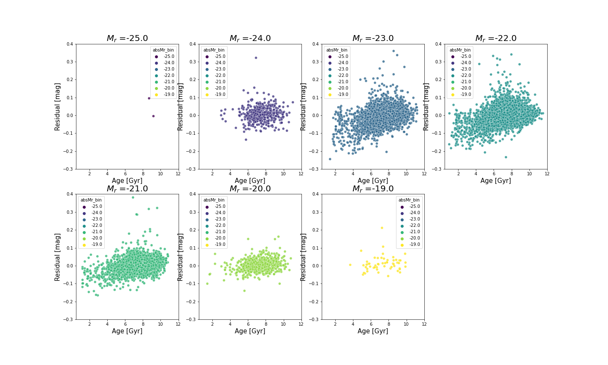

The goal of this project was to analyze the relationships between galaxy properties by simulating galaxy evolution using the Bruzual & Charlot 2003 (BC03) stellar population synthesis models.

I used different types of Star Formation Rates (SFR) and different metallicities to model the evolution of 50 galaxies. The types of SFR models I employed were:
  - Istantaneous burst (the Single Stellar Population (SSP) model)
  - Exponential declining with tau=1, 2 and 3 Gyrs
  - Single burst of length tau=2 Gyrs

The BC03 models I used output tables of data (such as color and stellar mass) as a function of age. For each SFR + metallicity combination, I found the predicted age at which the model's evolution corrected g-r color agrees with the actual age of the galaxy.

The age-metallicity degeneracy suggests that, for a given observed property (e.g., color), there could be multiple combinations of age and metallicity that result in a similar observed value. We see there is indeed an age-metallicity degeneracy since, for a given g-r color, various SFR models + metallicity combinations give varying ages.

In the table below, which is just a snippit of a larger table that contains the predicted ages for each galaxy based on the SFR model + metallicity combination, the column names (0 - 9) each represent a different galaxy. The row names on the left hand side (i.e.ssp_m122) represent different SFR model + metallicity combinations. The data within the table all represent the best SFR-model predicted age for the galaxy given the g-r color.

<b style="font-size: 24px;">Age-Metallicity Table:</b>


As we can see, based on the given g-r color value, different SFR model + metalicity combinations can give very different predicted ages.

Next, I use the evolution corrected g-r color values for 50 galaxies to find which model best fits that color. To do this, I loaded the model data, calculated the predicted colors, found the best-fit model for each galaxy, and stored the results in a data frame. 

### Finding the best-fit model for each galaxy:
```
# Define models and metallicities
model = [r"...\ssp\hr_chabrier_ssp_", ...]  # list of 5 model paths
model_name = ["ssp", "exp1", "exp2", "exp3", "sb2"]
metallicity = ["m122", "m132", "m142", "m152", "m162", "m172"]

# Load galaxy data
color = gals50["color_gmr"].values
true_age = gals50["age"].values

# Iterate over galaxies and find best-fitting model
for z in range(len(gals50["z"])):
    gal_color = color[z]
    gal_age = true_age[z]
    best_age = 99.99
    best_model = None
    best_metallicity = None

    # Iterate over models and metallicities
    for i in range(len(model)):
        mod = model[i]
        name = model_name[i]
        for m in metallicity:
            # Load model data and calculate predicted color
            data = np.genfromtxt(mod+m+"_z_"+str(z)+".1ABmag", usecols=(0,2,3))
            color_gr = np.abs(data[:,1] - data[:,2])
            residual = np.abs(color_gr - gal_color)

            # Find best-fitting age and model
            age_best = data[:,0][np.where(residual == np.min(residual))][0]
            age_best = 10**age_best / (10**9)  # convert to Gyr
            if np.abs(age_best - gal_age) < np.abs(best_age - gal_age):
                best_age = age_best
                best_model = name
                best_metallicity = m

    # Store best-fitting model and age
    best_modelDF.loc[z] = [z, gal_age, best_age, best_model, best_metallicity]
```

Next, I can plot the best predicated age versus the true age of the galaxy sample!

### Best Predicted Age vs. True Age plotting code:
```
x_data = best_modelDF["Real Age (Gyr)"]
y_data = best_modelDF["Best Age (Gyr)"]

# Define the linear function to fit
def linear_function(x, m, b):
    return m * x + b

# Fit the data to the linear function
params, covariance = curve_fit(linear_function, x_data, y_data)

# Extract the slope (m) and y-intercept (b) from the parameters
m, b = params

# Create a line using the fitted parameters
fit_line = linear_function(x_data, m, b)

sns.scatterplot(data=best_modelDF, x="Real Age (Gyr)", y="Best Age (Gyr)", hue="Model").set_title("True age vs. Best age")
plt.plot(x_data, fit_line, color='bisque', label=f'Fitted Line: y = {m:.2f}x + {b:.2f}')
plt.ylim(3,15)
plt.show()
```
<b style="font-size: 24px;">Best Age vs. True Age:</b>


We see that most of the galaxies are best described by one of two SFR's: the younger galaxies are modeled best by an Exponential declining SFR with a timescale τ = 1Gyr, while the older galaxies seem to better modeled by the Single Stellar Population (instantaneous burst) SFR. This could indicate a shift in galaxy evolution, where galaxies transition from a period of intense star formation to a more quiescent phase.

Next, for each SFR, I estimated the K-correction in the r and g band for each of the same 50 galaxies using the BC03 models. The BC03 models return the K-correction as a function of redshift and age.

<b style="font-size: 24px;">R-band K-Correction:</b>


<b style="font-size: 24px;">G-band K-Correction:</b>


From the age and redshift values, I compute the formation time of each galaxy with the code below.

### Formation Time Calculation
```
def getTimeRedshiftInv(zi,age):
    h=0.7
    tH=(9.78/h)
    OmegaM=0.3
    OmegaL=(1.-OmegaM)
    x0=(np.sqrt(1. + OmegaM/OmegaL))
    Arcth0=(0.5*np.log((x0+1)/(x0-1)))
    t0=(tH*(2./3.)*Arcth0/x0/OmegaL)
    Ezi = np.sqrt(OmegaM*(1+zi)**3 + OmegaL)    
    xi = np.sqrt(1 + OmegaM*(1+zi)**3/OmegaL)
    Arcthi = 0.5*np.log((xi+1)/(xi-1))
    tzit0 = Ezi*(Arcthi/xi)/(Arcth0/x0)
    tformt0 = tzit0 - age/t0
    #tt=np.where(tformt0 <= 0.023) 
    #tformt0[tt]=0.023
    
    
    #if (tt[0] != -1.0) then tformt0[tt] = 0.023+tt*0.
    
    tform = age - t0*(1. - tzit0)

    lgT0 = np.log10(age)

    ztable = 13.46-np.arange(1346)*0.01

    Eztable = np.sqrt(OmegaM*(1+ztable)**3 + OmegaL)    
    xtable = np.sqrt(1 + OmegaM*(1+ztable)**3/OmegaL)
    ArcthTable = 0.5*np.log((xtable+1)/(xtable-1))
    tztablet0 = Eztable*(ArcthTable/xtable)/(Arcth0/x0)
    f=interpolate.interp1d(tztablet0,ztable,fill_value="extrapolate")
    zform = f(tformt0)
    return tform,zform
```

Once I have the formation times calculated, I can plot $$\frac{M_*}{L}$$ vs $$L$$ in bins of $$\Delta t_{form} = 1 Gyrs$$

<b style="font-size: 24px;">$$\frac{M_*}{L}$$ vs $$L$$:</b>


<b style="font-size: 24px;">$$\frac{M_*}{L}$$ vs $$L$$ Bin Separated:</b>


We can see that M/L increases with decreasing luminosity (especially in the top left plot). We can also see that M/L is larger for older galaxies (in all plots).

This suggests that the stellar populations in these galaxies are increasingly dominated by low-mass stars over time. As a galaxy evolves, the massive stars that formed early exhaust their fuel and evolve into lower-mass stars. New generations of stars (including low-mass stars) may continue to form, and the cumulative effect is an increasing number of low-mass stars, which have lower luminosities but longer lifetimes. Thus, they continue to shine for extended periods, and their contribution becomes more significant over time.


## Color vs. Velocity Dispersion
I fit a linear function to g-r color versus velocity dispersion, as shown in the code below.

### Fitting g-r color versus velocity dispersion:
```
from sklearn.linear_model import LinearRegression
# Extract relevant columns
data = Etypes[['color_gmr', 'log($\sigma$)']].dropna()

# Prepare the data
x = data['log($\sigma$)'].values.reshape(-1, 1)
y = data['color_gmr'].values

# Fit a linear regression model
model = LinearRegression()
model.fit(x, y)

# Get the coefficients
slope = model.coef_[0]
intercept = model.intercept_

# Plot the original data and the fitted line
plt.scatter(x, y, label='Original Data', color = 'violet', alpha = 0.5)
plt.plot(x, model.predict(x), color='lime', label='Linear Fit')
plt.xlabel('log($\sigma$) [$km/s$]')
plt.ylabel('g-r [mag]')
plt.title("Color g-r vs. Velocity Dispersion")
plt.legend()
plt.show()
```
<b style="font-size: 24px;">Color vs. Velocity Dispersion:</b>


I also computed the residuals of the color-velocity dispersion by subtracting the fit values from the color values and plotted the residuals vs. the corresponding age of the galaxy in bins of absolute magnitude.

<b style="font-size: 24px;">Residuals vs. Age in bins of Absolute Magnitude:</b>



We can see that for older galaxies, the residuals are larger and more positive than those for youngergalaxies, which tend to be negative.
